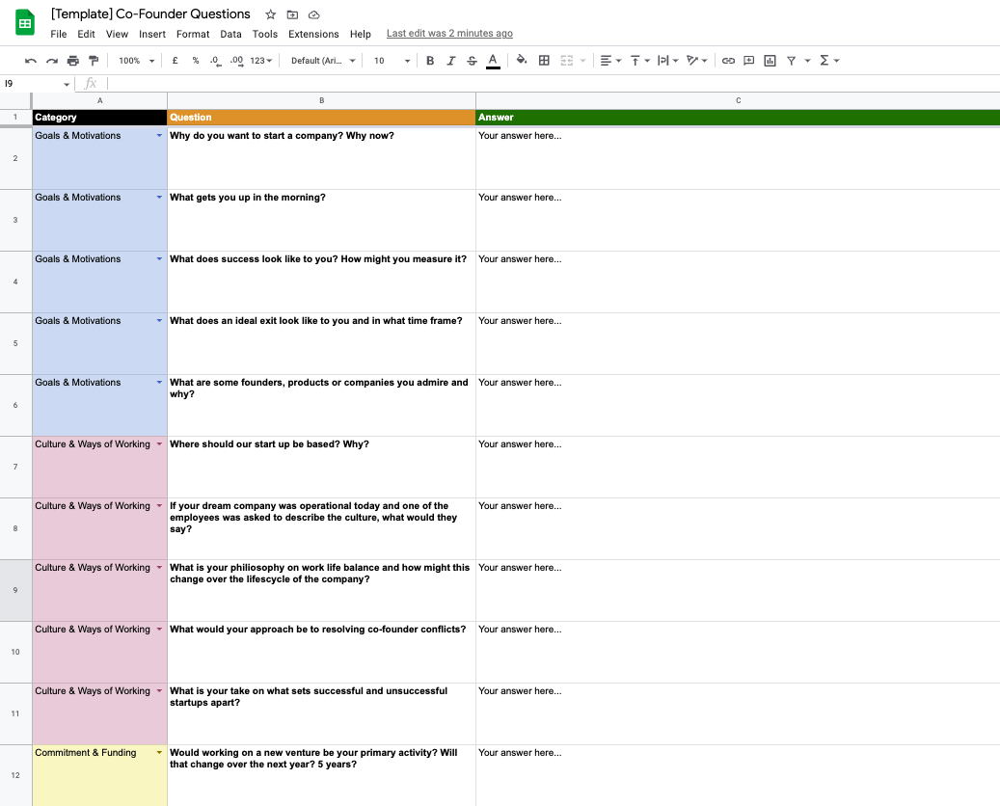

# Top 15 Questions to Ask a Potential Co-Founder

## Finding the Right Co-Founder is Hard

There are many reasons why startups might fail. One of those reasons
that isn't uncommon is founder breakups - therefore, following a
consistent co-founder dating process is critical to the success of
multi-founder startups.

Asking the right questions early on can help quickly identify a
mismatch and prevent butting heads after the fact.

I've put together a succinct list of the questions that I like to ask
when searching for potential co-founders. The key thing to keep in
mind here is to be consistent, so when it comes to evaluation (which
you can find later in this post), it's easier to accurately compare
and contrast the answers. Feel free to cherry pick or reframe the
questions as you see fit.

You'll notice there is no skills section as I'll be following up with
a blog post dedicated to just that - and its also something we can
help you with by using Tertle co-founder matching. ;)

_Cofee meetup_

## Prerequisites

If you're short on time, I would advise putting these in a form and
sending it to them or using the template which you can find later in
this post. Otherwise, I'd advise asking them in-person 1 to 1 to get
the best answers in real time while taking notes.

Also, if you haven't already, make sure to answer these questions or
your own version of these questions yourself first. Again, this will
help with being methodical when it comes to cross evaluating the
answers. Share your answers with your partner(s) in turn.

## Goals & Motivations

1. Why do you want to start a company? Why now?
1. What gets you up in the morning?
1. What does success look like to you? How might you measure it?
1. What does an ideal exit look like to you and in what time frame?
1. What are some founders, products or companies you admire and why?

## Culture & Ways of Working

1. Where should our start up be based? Why?
1. If your dream company was operational today and one of the employees was asked to describe the culture, what would they say?
1. What is your philiosophy on work life balance and how might this change over the lifecycle of the company?
1. What would your approach be to resolving co-founder conflicts?
1. What is your take on what sets successful and unsuccessful startups apart?

## Commitment & Funding

1. Would working on a new venture be your primary activity? Will that change over the next year? 5 years?
1. How should founder equity be split? Why?
1. What is your personal financial runway and burn rate?
1. What is your minimum salary expectations pre product-market fit?
1. What would it take for you to feel truly partnered in this venture?

[view](https://docs.google.com/spreadsheets/d/1HSkSQr46yV36uMU2iJVmuwtyRkIBvocjeLkC0fODqr0/edit?usp=sharing") |
[download](./Co-Founder-Questions-Template.xlsx)

## Evaluating the Answers

Section update to follow soon

## In Summary

It's quite rare to meet your ideal co-founder on your first rodeo and
there is no such thing as the perfect co-founder or perfect person. The
goal should be for their strengths to compliment your weaknesses and
vice versa.

Figure out which areas are dealbreakers and which ones can be overcome
or worked on and repeat the process until you find the right fit. Good
luck, fellow founders!
